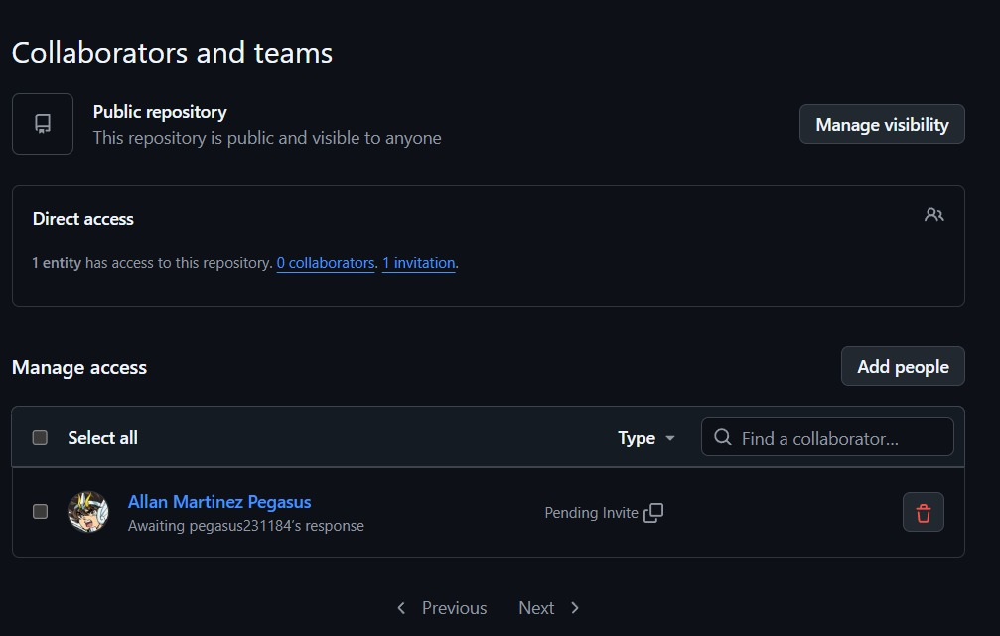
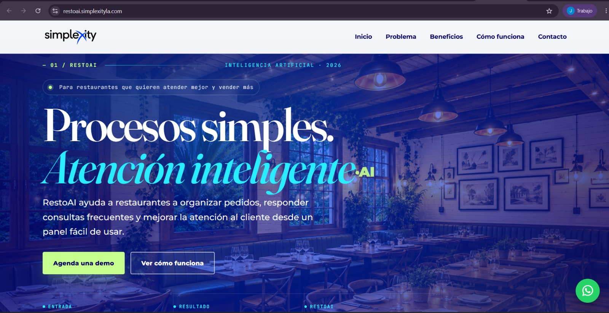
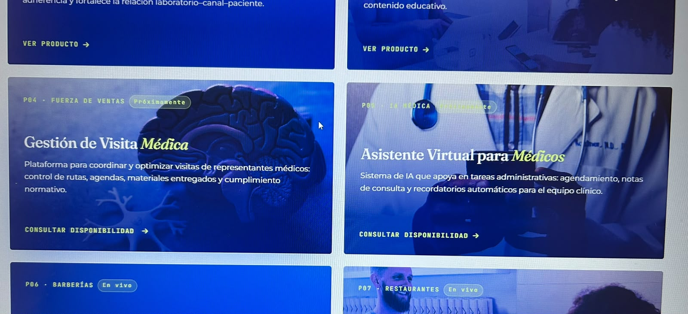
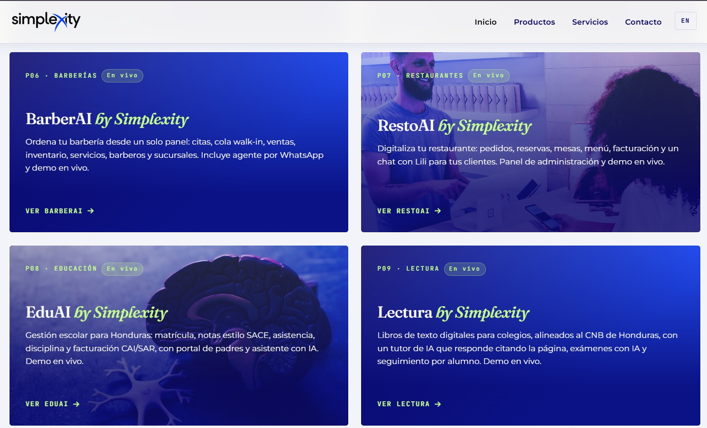
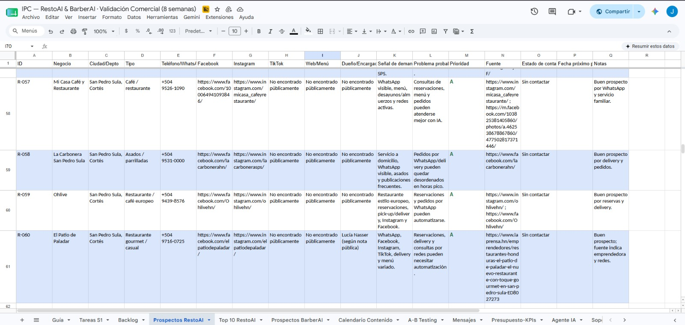
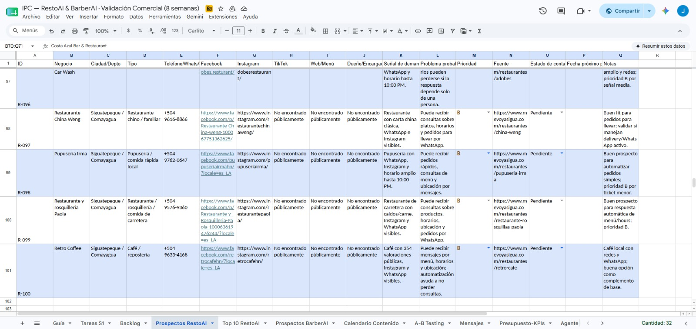

# Bitácora de práctica profesional — Semana 3

## Lunes 15 de junio

### Avance parcial del día

Durante la jornada se inició la revisión del deploy correspondiente a RestoAI, siguiendo la indicación de revisar y documentar el estado actual del producto antes de realizar modificaciones. El objetivo principal fue probar el funcionamiento como cliente, identificar problemas visibles y dejar evidencia para la bitácora.

---

## 1. Revisión de acceso en GitHub

### Actividad realizada

Se verificó que Allan Martínez ya tiene invitación enviada al repositorio. La invitación aparece pendiente de aceptación.

### URL revisada

https://github.com/josuedanielcerna49-sys/landing-restoai

### Nota

La verificación se realizó desde la sección **Settings > Collaborators and teams** del repositorio. En la captura se observa que la invitación a Allan Martínez aparece como pendiente de aceptación.

### Resultado esperado

Que Allan tenga acceso como administrador o colaborador autorizado al repositorio.

### Resultado actual

La invitación ya fue enviada, pero aparece pendiente de aceptación por parte de Allan.

### Prioridad sugerida

Media

### Captura de evidencia

---

## 2. Revisión del deploy de RestoAI

### Actividad realizada

Se revisó el deploy de RestoAI como cliente para comprobar si carga correctamente, si permite navegar dentro del producto y si el flujo principal funciona.

### URL revisada

https://restoai.simplexityla.com/

### Resultado esperado

Que el producto RestoAI cargue correctamente, permita navegar como cliente y tenga integrado el chatbot trabajado anteriormente.

### Resultado actual

El deploy de RestoAI sí carga correctamente y se puede navegar dentro de la página. El flujo principal funciona, pero el chatbot trabajado anteriormente no aparece integrado en el deploy actual.

### Prioridad sugerida

Alta para el chatbot, porque es parte importante de la experiencia del producto antes de una demo comercial.

### Captura de evidencia

---

## 3. Nota separada sobre el chatbot de RestoAI

### Actividad realizada

Se revisó si el chatbot trabajado anteriormente aparece integrado dentro del deploy actual de RestoAI.

### URL revisada

https://restoai.simplexityla.com/

### Resultado esperado

Que el chatbot de RestoAI aparezca integrado en el deploy y pueda responder preguntas relacionadas con el producto.

### Resultado actual

El chatbot no aparece integrado en el deploy actual. La página de RestoAI carga y permite navegar, pero no se visualiza el chatbot dentro del sitio.

### Prioridad sugerida

Alta

### Evidencia

La evidencia se muestra en la misma captura del deploy de RestoAI:

---

## 4. Revisión de página principal de Simplexity

### Actividad realizada

Se revisó la página principal de Simplexity, donde aparecen las tarjetas o landings de los productos y servicios.

### URL revisada

https://www.simplexityla.com/

---

## 4.1 Problemas de navegación en tarjetas

### Elementos revisados

* Gestión de Visita Médica
* Asistente Virtual para Médicos

### Resultado esperado

Que las tarjetas, imágenes o botones de estas landings permitan navegar correctamente al producto, consultar disponibilidad o abrir la información correspondiente.

### Resultado actual

Las tarjetas o imágenes de **Gestión de Visita Médica** y **Asistente Virtual para Médicos** no funcionan correctamente para navegar. Al intentar acceder desde la tarjeta o imagen, no se logra entrar al producto o a la información esperada.

### Prioridad sugerida

Alta, si estas landings se necesitan mostrar en una demo comercial o en una revisión con cliente.

### Captura de evidencia

---

## 4.2 Problemas visuales en tarjetas de productos

### Elementos revisados

* BarberAI
* RestoAI
* EduAI
* Lectura de Simplexity

### Resultado esperado

Que cada tarjeta de producto tenga una imagen visible, relacionada con el servicio que representa y coherente con el contenido de la landing.

### Resultado actual

Se detectaron problemas visuales en varias tarjetas de la página principal:

* **BarberAI** no tiene imagen visible en la tarjeta.
* **RestoAI** tiene una imagen que no coincide claramente con el producto, ya que debería representar restaurante, comida, pedidos, atención por WhatsApp o automatización de pedidos.
* **EduAI** tiene una imagen que no coincide claramente con el servicio que representa.
* **Lectura de Simplexity** no tiene imagen visible en la tarjeta.

### Prioridad sugerida

Media, porque no bloquea por completo la navegación principal, pero sí afecta la presentación visual y la calidad de una posible demo comercial.

### Captura de evidencia

---

## 5. Resumen de hallazgos hasta el momento

* Allan ya tiene invitación enviada en GitHub, pendiente de aceptación.
* El deploy de RestoAI sí carga correctamente.
* El flujo principal de RestoAI sí funciona.
* El chatbot trabajado anteriormente no aparece integrado en el deploy actual.
* En la página principal de Simplexity se detectaron problemas de navegación en algunas landings.
* Gestión de Visita Médica y Asistente Virtual para Médicos no funcionan correctamente al intentar navegar desde la tarjeta o imagen.
* BarberAI no tiene imagen visible en su tarjeta.
* Lectura de Simplexity no tiene imagen visible en su tarjeta.
* La imagen de RestoAI no coincide claramente con lo que debería representar el producto.
* La imagen de EduAI tampoco coincide claramente con el servicio.

---

### Avance en prospectos

Se creó y organizó un archivo Excel para los prospectos de RestoAI en Comayagua. Se registraron 20 prospectos con información de negocio, ubicación, teléfono/WhatsApp, redes sociales, tipo de negocio, razón por la que es buen prospecto, cómo RestoAI podría ayudarle, estado y fuente.

Archivo relacionado:

[Ver Excel de prospectos RestoAI](./prospectos_restoai_actualizado_.xlsx)

La meta mínima de 20 prospectos del día quedó completada.

---

## Martes 16 de junio

### Avance del día

Durante la jornada se continuó con la expansión de prospectos para RestoAI, tomando como base los 20 prospectos de Comayagua que ya habían sido verificados en la hoja oficial. El objetivo del día fue completar nuevas ciudades, revisar la información de contacto, clasificar los prospectos y dejar evidencia del avance.

---

## 1. Expansión de prospectos RestoAI

### Actividad realizada

Se agregaron prospectos nuevos para RestoAI en las ciudades de **Tegucigalpa** y **San Pedro Sula**, siguiendo el filtro de restaurantes locales, cafeterías, comida rápida local, restaurantes/bar y negocios de comida con posibilidad de recibir pedidos o consultas por WhatsApp y redes sociales.

No se incluyeron cadenas grandes como Wendy’s, KFC, McDonald’s, Popeyes u otras similares, porque este tipo de negocios normalmente ya cuenta con sistemas internos de atención y pedidos.

### Resultado esperado

Completar 60 prospectos totales de RestoAI en la hoja oficial:

* 20 prospectos de Comayagua.
* 20 prospectos de Tegucigalpa.
* 20 prospectos de San Pedro Sula.

### Resultado actual

La hoja oficial de **Prospectos RestoAI** quedó actualizada con **60 prospectos totales**:

| Ciudad         |       Rango de ID | Cantidad |
| -------------- | ----------------: | -------: |
| Comayagua      |     R-001 a R-020 |       20 |
| Tegucigalpa    |     R-021 a R-040 |       20 |
| San Pedro Sula |     R-041 a R-060 |       20 |
| **Total**      | **R-001 a R-060** |   **60** |

### Captura de evidencia

---

## 2. Revisión de datos y redes sociales

### Actividad realizada

Se revisaron manualmente los datos de los prospectos nuevos antes de dejarlos como avance en la hoja oficial. Se verificó que los restaurantes fueran negocios locales y que contaran con información útil para prospección.

### Datos revisados

* Nombre del negocio.
* Ciudad/departamento.
* Tipo de restaurante.
* Teléfono o WhatsApp.
* Facebook.
* Instagram.
* Fuente.
* Señal de demanda.
* Problema probable.
* Prioridad.
* Estado de contacto.
* Notas.

### Resultado actual

Los prospectos de Tegucigalpa y San Pedro Sula fueron agregados con datos completos en la hoja oficial. También se revisaron las redes sociales y contactos para evitar dejar información inventada o dudosa.

---

## 3. Clasificación A/B/C

### Actividad realizada

Se inició la clasificación de los prospectos según su nivel de oportunidad comercial para RestoAI.

### Criterio utilizado

* **Prioridad A:** restaurante con contacto real, redes activas, señales claras de demanda, posibilidad de pedidos/reservas y dolor probable de atención por WhatsApp o redes.
* **Prioridad B:** buen prospecto, pero falta confirmar más volumen, actividad o necesidad clara.
* **Prioridad C:** prospecto a futuro, con menor información, menor actividad visible o menor urgencia para automatización.

### Resultado actual

La clasificación A/B/C quedó iniciada en la hoja oficial, tomando en cuenta contacto disponible, redes sociales, señales de demanda y problema probable.

---

## 4. Conteo parcial por ciudad

### Resultado

| Ciudad         | Cantidad de prospectos |
| -------------- | ---------------------: |
| Comayagua      |                     20 |
| Tegucigalpa    |                     20 |
| San Pedro Sula |                     20 |
| **Total**      |                 **60** |

---

## 5. Top 10 preliminar de RestoAI

### Actividad realizada

Se trabajó un **Top 10 general** de los 60 prospectos de RestoAI. La selección responde a la pregunta: si mañana solo se pudieran contactar 10 restaurantes, cuáles serían los mejores y por qué.

### Criterio utilizado

Se priorizaron los restaurantes con mayor posibilidad de aceptar una demo o necesitar RestoAI, tomando en cuenta:

* Contacto real disponible.
* WhatsApp, teléfono, Facebook o Instagram.
* Redes activas.
* Señales de demanda.
* Pedidos, reservas, eventos o delivery.
* Buena presencia digital.
* Problema probable relacionado con atención lenta, pedidos desordenados o muchas consultas repetidas.

### Conteo del Top 10 por ciudad

| Ciudad         | Cantidad en Top 10 |
| -------------- | -----------------: |
| Comayagua      |                  3 |
| Tegucigalpa    |                  4 |
| San Pedro Sula |                  3 |
| **Total**      |             **10** |

---

## 6. Resumen del avance del martes

* Se agregaron 20 prospectos de Tegucigalpa para RestoAI.
* Se agregaron 20 prospectos de San Pedro Sula para RestoAI.
* La hoja oficial quedó con 60 prospectos totales de RestoAI.
* Se revisaron redes sociales y contactos de los prospectos nuevos.
* Se evitó incluir cadenas grandes porque no encajan bien con el cliente ideal.
* Se inició la clasificación A/B/C.
* Se hizo conteo parcial por ciudad.
* Se preparó el Top 10 general preliminar de RestoAI.
* Se dejó evidencia con una captura de la hoja oficial mostrando los 60 prospectos.

---

## 7. Pendientes

* Completar o ajustar la clasificación A/B/C si Amena solicita cambios.
* Revisar el Top 10 preliminar si se requiere mayor justificación.
* Continuar con el seguimiento de prospectos según el plan comercial.
* Mantener pendiente externo: aceptación de la invitación de GitHub por parte de Allan.
* Mantener pendiente técnico observado: chatbot no integrado en el deploy actual.

## Miércoles 17 de junio

Este día inicié revisando el backlog indicado por Allan para asegurar que lo trabajado en los días anteriores estuviera completo antes de continuar con las tareas nuevas. Verifiqué el estado de la hoja oficial de RestoAI, revisé que los prospectos ya cargados tuvieran información completa y confirmé que la base estuviera organizada por ciudad, tipo de negocio, canal de contacto, señal de demanda, problema probable y prioridad A/B/C.

También trabajé en la ampliación de la base comercial de RestoAI hasta llegar a **100 prospectos reales**. La base quedó distribuida en cinco bloques principales: Comayagua, Tegucigalpa, San Pedro Sula, La Ceiba / Tela / Atlántida y Siguatepeque. Para completar los nuevos registros se investigaron restaurantes, cafés y negocios de comida con presencia pública en redes sociales, teléfonos o WhatsApp disponibles, evitando cadenas grandes o registros débiles.

Se seleccionó **La Ceiba / Tela / Atlántida** como bloque adicional por su potencial turístico, concentración de restaurantes, zona costera, presencia de bares/cafés/comida local y señales de demanda en redes sociales o contactos públicos. También se incluyó **Siguatepeque** como complemento por ser una ciudad con movimiento comercial, restaurantes locales, cafés y negocios con atención por WhatsApp y redes sociales.

Después de completar la base, realicé los conteos finales del mercado para analizar la distribución de prospectos por ciudad/zona, tipo de negocio, prioridad A/B/C y canales disponibles como teléfono, WhatsApp, Facebook, Instagram, TikTok y web/menú. Esto permitió tener una visión más clara del mercado inicial para RestoAI y de los segmentos con mayor oportunidad comercial.

También se actualizó el **Top 10 RestoAI** con base en los 100 prospectos revisados. La selección se hizo priorizando negocios con mejor encaje comercial, prioridad A, canales de contacto visibles, presencia activa en redes, señales de demanda y problemas que RestoAI puede resolver, como consultas por WhatsApp, pedidos, menú, horarios, ubicación, reservaciones o atención en horas pico.

Además, preparé la propuesta de **campaña piloto para RestoAI**, definiendo audiencia, geografía, presupuesto inicial, canal de campaña y objetivo comercial. La campaña se planteó para Meta Ads con conversión hacia WhatsApp, enfocada en generar conversaciones y agendar demos con dueños, administradores o encargados de restaurantes y cafés.

Finalmente, redacté tres copies de anuncio para RestoAI con diferentes enfoques: dolor, solución y oferta. Todos fueron orientados a WhatsApp como canal de contacto para solicitar información o agendar una demostración.

### Evidencia

### Resumen del día

* Se revisó el backlog pendiente.
* Se completó la base comercial hasta 100 prospectos RestoAI.
* Se investigaron y validaron nuevos prospectos de La Ceiba / Tela / Atlántida y Siguatepeque.
* Se mantuvo la clasificación por prioridad A/B/C.
* Se realizaron conteos finales por ciudad, tipo, canal y prioridad.
* Se actualizó el Top 10 general de RestoAI.
* Se preparó el análisis de mercado.
* Se definió la campaña piloto.
* Se redactaron 3 copies de anuncio con CTA a WhatsApp.
* Se guardó evidencia de la hoja oficial con los 100 prospectos.

## Jueves 18 de junio

Este día se inició revisando el cierre del avance anterior de RestoAI para confirmar que el backlog del miércoles estuviera completo antes de avanzar con las tareas nuevas. Se verificó que la base de 100 prospectos, el análisis de mercado, el Top 10 justificado, la campaña piloto, los copies de anuncio, la evidencia y el respaldo en GitHub ya estuvieran cerrados.

Luego trabajé en la parte creativa y comercial de RestoAI, enfocada en presentar el producto de una forma más clara y vendible. Se prepararon artes estilo Simplexity para comunicar que RestoAI no es solo un chatbot, sino un sistema completo para restaurantes con inteligencia artificial.

Se elaboró un arte en formato **feed 1080×1080** con enfoque en presentar a RestoAI como un sistema para administrar restaurantes con IA. También se preparó un arte en formato **story 1080×1920**, adaptado a las zonas seguras de Instagram para evitar que el contenido principal fuera tapado por el nombre de usuario, música o controles de la aplicación.

Durante la revisión de los mensajes comerciales, se ajustó el enfoque para no limitar RestoAI únicamente a responder mensajes por WhatsApp. Se tomó en cuenta que el sistema incluye funciones como pedidos, reservas, menú, clientes, reclamos, panel administrativo, atención con Lili, monitor de chat y supervisión humana.

También se documentó un **concepto de video para RestoAI**, con la idea “Del cliente al panel: todo conectado con RestoAI”. El concepto muestra cómo un cliente interactúa con Lili, cómo puede consultar menú, hacer pedidos o reservas, y cómo esa información llega al panel administrativo para que el restaurante pueda darle seguimiento.

Además, se preparó el **guion corto + idea de demo de Lili**, mostrando el flujo principal: un restaurante recibe pedidos, reservas y consultas; un cliente entra al chat de Lili; Lili le muestra el menú y ayuda con pedido o reserva; la información llega al panel administrativo; y el equipo puede supervisar o tomar control cuando sea necesario.

Finalmente, se armó el documento del **agente de prospección por WhatsApp para RestoAI**, definiendo el flujo de apertura, calificación, identificación de prospecto A, escalado a humano, cierre a demo, respuestas a objeciones básicas y reglas para no parecer spam. Este agente está pensado para contactar dueños o encargados de restaurantes, no para atender clientes finales.

### Evidencia

* Arte feed RestoAI 1080×1080 estilo Simplexity: `evidencias/feed-restoai-simplexity.jpeg`
* Arte story RestoAI 1080×1920 estilo Simplexity: `evidencias/story-restoai-simplexity.jpeg`
* Documentación creada en `Documentacion/`:

  * `CONCEPTO_VIDEO_RESTOAI.md`
  * `GUION_DEMO_LILI_RESTOAI.md`
  * `AGENTE_PROSPECCION_WHATSAPP_RESTOAI.md`

### Resumen del día

* Se revisó el cierre del backlog del miércoles.
* Se preparó arte feed 1080×1080 para RestoAI.
* Se preparó arte story 1080×1920 para RestoAI.
* Se ajustó el mensaje comercial para presentar RestoAI como sistema completo.
* Se documentó el concepto de video de RestoAI.
* Se creó el guion corto + idea de demo de Lili.
* Se armó el flujo del agente de prospección por WhatsApp.
* Se dejó preparado el material para respaldo en GitHub.

### Chequeo final de hoja oficial

También se realizó el chequeo final de la hoja oficial de **Prospectos RestoAI** para confirmar que la base quedara limpia antes del cierre. Se verificó que los registros estén completos de **R-001 a R-100**, sin errores visibles, sin IDs duplicados y con los estados nuevos corregidos como **Sin contactar** en lugar de Pendiente.

Se dejó evidencia visual de la hoja oficial mostrando los 100 prospectos y confirmando que no quedan celdas con `#ERROR` dentro de la tabla principal.

**Evidencia agregada:**

* `evidencias/prospectos-restoai-100-hoja-limpia.png`

## Viernes 19 de junio

Este día se inició revisando el backlog acumulado de la semana para confirmar que los entregables principales de RestoAI estuvieran completos antes del cierre. Se revisó el avance comercial y documental trabajado durante la semana, incluyendo la base de prospectos, análisis de mercado, Top 10, campaña piloto, artes, guion de demo, agente de prospección y evidencias.

También se confirmó que la hoja oficial de **Prospectos RestoAI** quedara limpia, con los registros de **R-001 a R-100**, sin errores visibles en la tabla principal, sin IDs duplicados y con los estados nuevos marcados como **Sin contactar**. Se dejó evidencia visual de la hoja limpia para respaldar el cierre.

Durante el día se trabajó en la preparación final de la campaña piloto de RestoAI. Se documentó una campaña en estado **borrador/pausa**, lista para revisión antes de ser activada. La campaña fue planteada para Meta Ads como canal principal, con enfoque en Facebook e Instagram y CTA hacia WhatsApp para solicitar una demo.

También se preparó la estimación de resultados esperados según presupuesto. Se analizaron escenarios con inversión diaria de **L150, L200 y L250**, tomando como referencia el objetivo de generar conversaciones por WhatsApp, leads calificados y demos agendadas. Se recomendó iniciar con **L200 diarios durante 7 días**, equivalente a **L1,400 semanales**, para obtener datos suficientes sin escalar antes de validar el mensaje.

Se actualizó el archivo `README.md` del repositorio para que reflejara el cierre completo de la semana. El README quedó reorganizado con la descripción del proyecto, link del deploy, tecnologías utilizadas, documentación comercial, evidencias, estado actual, avances completados y pendientes antes del outreach.

Además, se preparó el documento de **mini-demo RestoAI de 5 a 7 minutos**, con una estructura clara para explicar el producto ante Allan. La demo incluye presentación de RestoAI, problema del mercado, cliente ideal, funcionamiento de Lili, panel administrativo, supervisión humana, campaña, prospectos y siguientes pasos comerciales.

También se respondió por escrito el documento de **8 preguntas de criterio**, incluyendo cliente ideal, cantidad de prospectos reales, Top 10 justificado, presupuesto recomendado, canal inicial, mensaje de contacto, forma de calificación del agente y acciones del humano después de conseguir interés.

### Archivos trabajados o actualizados

* `README.md`
* `Documentacion/CAMPANA_BORRADOR_RESTOAI.md`
* `Documentacion/ESTIMACION_RESULTADOS_RESTOAI.md`
* `Documentacion/MINI_DEMO_RESTOAI.md`
* `Documentacion/PREGUNTAS_CRITERIO_RESTOAI.md`
* `Documentacion/BITACORA_SEMANA_3.md`

### Evidencia

* `evidencias/prospectos-restoai-100-hoja-limpia.jpeg`
* `evidencias/feed-restoai-simplexity.jpeg`
* `evidencias/story-restoai-simplexity.jpeg`

### Resumen del día

* Se revisó el backlog del jueves.
* Se confirmó la hoja oficial limpia con 100 prospectos.
* Se dejó campaña piloto en borrador/pausa.
* Se estimaron resultados esperados según presupuesto.
* Se actualizó el README del proyecto.
* Se ordenó la documentación comercial.
* Se preparó la mini-demo de 5 a 7 minutos.
* Se respondieron las 8 preguntas de criterio.
* Se dejó el proyecto listo para respaldo final en GitHub.

### Pendientes no bloqueantes

* Validar WhatsApp/teléfonos activos del Top 10 antes de contactar.
* No iniciar outreach hasta autorización.
* Activar campaña solo con aprobación de Allan.
* Confirmar si Allan ya aceptó la invitación de GitHub.
* Integrar mejoras técnicas del chatbot/formulario solo si se solicita en una fase posterior.

## Nota de estado comercial

La campaña de RestoAI queda únicamente preparada en estado borrador/pausa. No se activó pauta en Meta Ads, Google Ads ni ningún otro canal.

El outreach a prospectos tampoco fue ejecutado. Los mensajes, flujo de agente y Top 10 quedan preparados para una siguiente fase.

Antes de contactar prospectos reales, se debe validar visualmente que los WhatsApp/teléfonos del Top 10 estén activos y contar con autorización para iniciar el contacto.